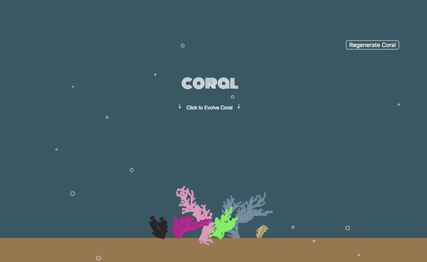
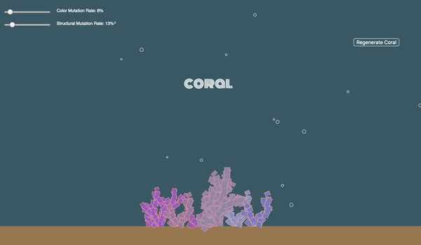
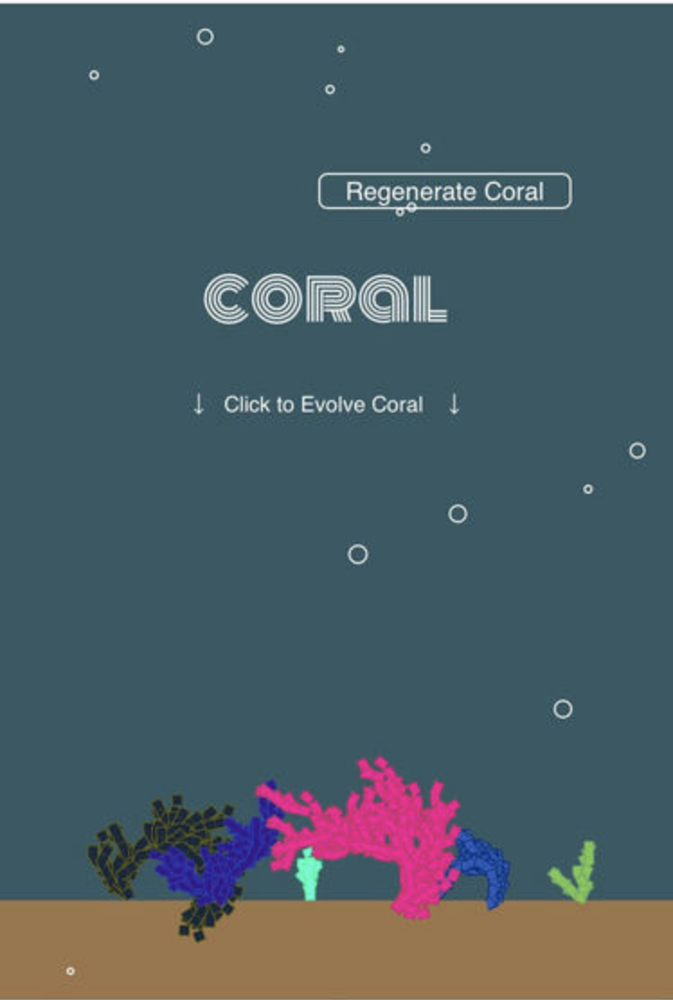
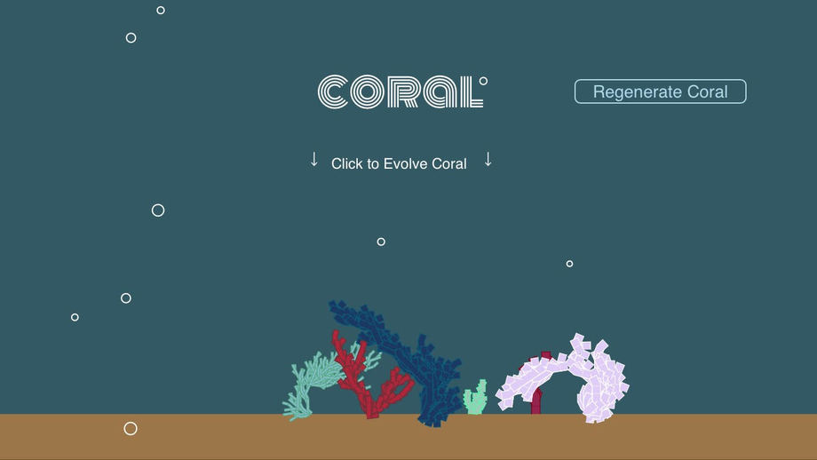

## Coral
Live Site: [trevorzs.github.io/Coral](trevorzs.github.io/Coral)  



## Background
#### Generative Art
Generative Art refers to art that is created partly by an autonomous system. It can refer to art being primarily driven by complex algorithms or a mixture of machine and user input. This web app is an interactive visualization of generative coral.

## About
#### Coral
This web app was created entirely in JavaScript, utilizing the p5.js library. In this app, coral are generated using a stochastic Lindenmayer System(l-system). Each coral then stores different properties as a virtual "genotype". Clicking on a coral will cause a new set of coral to be generated, based on the "genetics" of the coral that was clicked. This allows for dynamic evolution of the coral guided by user input.

Taking advantage of object oriented principles, coral can differ by primary color, outline color, width, length, angle of each branch, genetic structure, color variance, color mutation rate and more.

For more info on l-systems and how I implemented them in this app, scroll to the bottom of this readme.

## Functionality and MVP
Click on a button to reset and reseed initial coral with randomized properties

Click on a coral to generate a new set of coral based on clicked coral's "genetics"

Sliders allow users to alter genetic change from one generation to the next


## Mobile Support
Making use of p5.js' touchEnded, touchStarted() and resize() methods, Coral now works on most browsers including touchscreen mobile. It will adjust to landscape mode on your phone as well. However, due to known issues with resizing p5 and Android, the app may lag on an Android device. Future todos include resolving this issue.

Coral on iPhone Chrome Browser:


Coral on iPhone landscape mode:


## Stochastic Lindenmayer System
Lindenmayer Systems, better known as l-systems, are a popular type of formal grammar in algorithmic botany. They are useful in imitating different structures of plants based on the provided rules and axioms.

On each iteration, the previous string (beginning with the axiom) will be read through, applying a rule for each letter in the previous string. Since this process is exponential, each Coral only iterates 2-3 times for processing efficiency.

For this web app, I have created three rules to apply to a single axiom, "F". When generating the string to be interpreted, the algorithm may choose between the three rules with equal probability (thus making it stochastic). This creates a larger variation in shape and structure of the coral.

##### Axiom: "F"

##### Rules:

a: "F",
b: "+[+FF]-[-F+F+F]F"

a: "F",
b: "+[+F-F-F]F-[-F+F+F]-FF"

a: "F",
b: "F[+F]F[-F][F]"

##### Example Generated String:

1st iteration:
"F" -> "+[+FF]-[-F+F+F]F"

3rd iteration:

 "+[++[+FF]-[-F+F+F]F[+F[+F]F[-F][F]]F[+F]F[-F][F][-F[+F]F[-F][F]][F[+F]F[-F][F]]-+[+F-F-F]F-[-F+F+F]-FF[++[+F-F-F]F-[-F+F+F]-FF]+[+F-F-F]F-[-F+F+F]-FF[-F[+F]F[-F][F]][+[+F-F-F]F-[-F+F+F]-FF]-+[+F-F-F]F-[-F+F+F]-FF[++[+F-F-F]F-[-F+F+F]-FF]F[+F]F[-F][F][-+[+F-F-F]F-[-F+F+F]-FF][+[+FF]-[-F+F+F]F]]+[++[+FF]-[-F+F+F]F+[+FF]-[-F+F+F]F]-[-F[+F]F[-F][F]++[+FF]-[-F+F+F]F++[+FF]-[-F+F+F]F]F[+F]F[-F][F]-[-+[+F-F-F]F-[-F+F+F]-FF[+F[+F]F[-F][F]]+[+FF]-[-F+F+F]F[-+[+FF]-[-F+F+F]F][+[+FF]-[-F+F+F]F]++[++[+F-F-F]F-[-F+F+F]-FF-+[+F-F-F]F-[-F+F+F]-FF-F[+F]F[-F][F]]+[+FF]-[-F+F+F]F-[-+[+F-F-F]F-[-F+F+F]-FF++[+FF]-[-F+F+F]F++[+FF]-[-F+F+F]F]-F[+F]F[-F][F]+[+FF]-[-F+F+F]F++[++[+F-F-F]F-[-F+F+F]-FF-+[+F-F-F]F-[-F+F+F]-FF-+[+F-F-F]F-[-F+F+F]-FF]+[+F-F-F]F-[-F+F+F]-FF-[-+[+FF]-[-F+F+F]F+F[+F]F[-F][F]++[+F-F-F]F-[-F+F+F]-FF]-F[+F]F[-F][F]F[+F]F[-F][F]]-+[+F[+F]F[-F][F]+[+F-F-F]F-[-F+F+F]-FF]-[-+[+F-F-F]F-[-F+F+F]-FF++[+FF]-[-F+F+F]F++[+FF]-[-F+F+F]F]+[+F-F-F]F-[-F+F+F]-FF+[++[+F-F-F]F-[-F+F+F]-FFF[+F]F[-F][F]]-[-F[+F]F[-F][F]++[+F-F-F]F-[-F+F+F]-FF++[+F-F-F]F-[-F+F+F]-FF]+[+F-F-F]F-[-F+F+F]-FF"

This resulting string is then iterated over. For each character in the string, a different thing will be rendered. F will render the coral's base shape. +/- will apply a rotate transformation based on the coral's angle gene. And "[" / "]" will push/pop the transformation slate, allowing branches to branch off without dramatically altering future transformations.

```
for (var i = 0; i < l.length; i++) {
  if (l[i] == "F"){
    strokeWeight(0.8);
    this.shape(len);
    translate(0,-len);
  } else if (l[i] == "+"){
    rotate(this.angle-diff);
  } else if (l[i] == "-"){
    rotate(-this.angle-diff);
  } else if (l[i] == "["){
    push();
  } else if (l[i] == "]"){
    pop();
  }
}
```

As can be seen, each coral has its own render method for its own unique genetic structure. The render method takes into account the corals' traits, allowing for customizability when guiding its evolution. The objects are set up so that additional traits can be easily tacked on. For example, one could vary each coral's base shape, or calculate a sturdiness so that some coral sways more and some sway less.


## Todo
There is extreme variation in types of coral found in nature. The algorithm I am using could always be tweaked to account for more types and produce more realistic coral upon evolution. Base shapes right now are rectangles. Variation of base shape may help render more realistic coral but may require more processing power.
